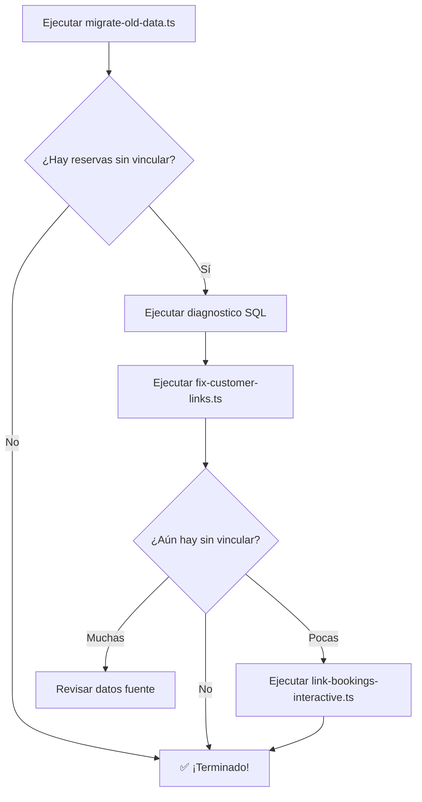
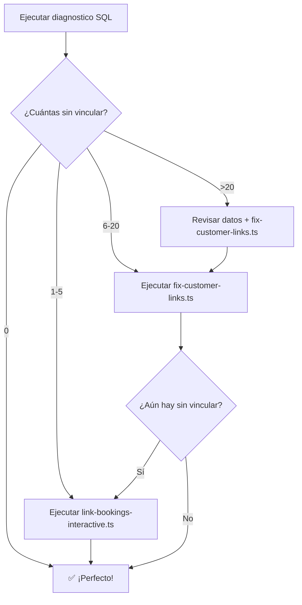

# 🛠️ Guía Completa: Scripts de Vinculación de Clientes

Esta guía documenta todos los scripts disponibles para solucionar el problema de vinculación de reservas con clientes después de la migración.

---

## 📚 Índice de Scripts

1. **`migrate-old-data.ts`** - Script principal de migración (mejorado)
2. **`fix-customer-links.ts`** - Reparación automática post-migración
3. **`link-bookings-interactive.ts`** - Vinculación interactiva manual
4. **`diagnostico-vinculacion-clientes.sql`** - Diagnóstico SQL en Supabase

---

## 1️⃣ Script Principal: `migrate-old-data.ts`

### ¿Qué hace?
Migra todos los clientes y reservas activas desde la base de datos antigua a Supabase, intentando vincularlas automáticamente.

### Mejoras implementadas:
✅ Vinculación por email (normalizado)  
✅ Vinculación por nombre completo (sin acentos)  
✅ Vinculación por teléfono  
✅ Logs detallados de cada vinculación  
✅ Estadísticas de éxito/fallo  

### Uso:

```bash
# Ejecutar migración completa
npx tsx scripts/migrate-old-data.ts
```

### Salida esperada:

```
✅ 1015 clientes migrados exitosamente
✅ 26 reservas activas migradas exitosamente
   ✓ 20 reservas vinculadas a clientes
   ⚠️  6 reservas SIN vincular a clientes
```

### ¿Cuándo usarlo?
- **Primera vez** que migras los datos
- Si quieres **re-importar** todo desde cero (borra datos antiguos primero)

---

## 2️⃣ Script de Reparación: `fix-customer-links.ts`

### ¿Qué hace?
Busca reservas huérfanas (`customer_id = NULL`) y intenta vincularlas automáticamente con clientes existentes.

### Características:
✅ Solo procesa reservas sin vincular  
✅ Ignora emails `@legacy.furgocasa.com`  
✅ Usa la misma estrategia de vinculación mejorada  
✅ No modifica reservas ya vinculadas  

### Uso:

```bash
# Ejecutar después de migrate-old-data.ts
npx tsx scripts/fix-customer-links.ts
```

### Salida esperada:

```
⚠️  Encontradas 6 reservas sin vincular

✓ Reserva 03a42991... vinculada por email: "Juan Pérez"
✓ Reserva 5e8f3a12... vinculada por nombre: "María García"
✗ No se pudo vincular: "Henning Pedersen" (hepe@mail.tele.dk)

✅ VINCULACIÓN COMPLETADA
✓ Reservas vinculadas: 2
✗ Reservas sin vincular: 4
```

### ¿Cuándo usarlo?
- **Después** de ejecutar `migrate-old-data.ts`
- Si el script de migración dejó reservas sin vincular
- **Antes** de vincular manualmente (intenta automatizar primero)

---

## 3️⃣ Script Interactivo: `link-bookings-interactive.ts`

### ¿Qué hace?
Permite revisar y vincular manualmente cada reserva huérfana, una por una, de forma interactiva.

### Características:
✅ Muestra detalles de cada reserva  
✅ Sugiere posibles coincidencias automáticas  
✅ Permite buscar clientes por email/nombre  
✅ Permite crear nuevos clientes sobre la marcha  
✅ Permite saltar reservas o salir en cualquier momento  

### Uso:

```bash
# Ejecutar en modo interactivo
npx tsx scripts/link-bookings-interactive.ts
```

### Ejemplo de sesión:

```
📋 RESERVA 1 de 4
────────────────────────────────────
Número: BK-20260119-3847
Cliente: Henning Pedersen
Email: hepe@mail.tele.dk
Teléfono: (sin teléfono)
Fecha recogida: 2026-03-15
Precio: 2170€
────────────────────────────────────

🔍 Posibles coincidencias encontradas:

  1. Henning Pedersen
     Email: henning.pedersen@gmail.com
     Tel: +4512345678
     ID: 5e8f3a12-...

  2. Henning P.
     Email: hepe@mail.dk
     Tel: (sin teléfono)
     ID: 8a3f2c45-...

Opciones:
  1-9: Seleccionar uno de los clientes sugeridos
  s: Saltar esta reserva
  b: Buscar cliente por email
  n: Buscar cliente por nombre
  c: Crear nuevo cliente
  q: Salir

¿Qué deseas hacer? 1

🔗 Vinculando reserva a "Henning Pedersen"...
✅ ¡Vinculado exitosamente!
```

### ¿Cuándo usarlo?
- Cuando `fix-customer-links.ts` no pudo vincular algunas reservas
- Para revisar manualmente casos complejos
- Cuando necesitas **verificar visualmente** antes de vincular

---

## 4️⃣ Script SQL: `diagnostico-vinculacion-clientes.sql`

### ¿Qué hace?
Ejecuta un análisis completo del estado de las vinculaciones directamente en Supabase.

### Información que proporciona:
- Total de reservas vinculadas vs. sin vincular
- Detalles de cada reserva huérfana
- Posibles coincidencias por email
- Posibles coincidencias por nombre (fuzzy matching)
- Estadísticas de clientes
- Top 10 clientes con más reservas
- Emails duplicados (problema potencial)
- Reservas por estado y vinculación

### Uso:

1. Ir a Supabase Dashboard → SQL Editor
2. Copiar el contenido de `diagnostico-vinculacion-clientes.sql`
3. Pegar y ejecutar
4. Revisar resultados

### Salida esperada:

```sql
📊 ESTADO GENERAL DE RESERVAS
─────────────────────────────
Total de reservas              | 26
Reservas vinculadas            | 20
Reservas SIN vincular          | 6
Porcentaje vinculado           | 76.92%

🔍 RESERVAS SIN VINCULAR
───────────────────────────────────────────────────
booking_number  | customer_name    | customer_email
BK-20260119-... | Henning Pedersen | hepe@mail.tele.dk
BK-20260119-... | John Doe         | john@example.com
...
```

### ¿Cuándo usarlo?
- **Antes** de ejecutar scripts de reparación (para ver estado actual)
- **Después** de ejecutar scripts (para verificar resultados)
- Para **tomar decisiones** sobre qué estrategia seguir

---

## 🔄 Flujo Recomendado

### Escenario 1: Primera Migración



### Escenario 2: Reparación de Datos Existentes



---

## 📊 Comparación de Scripts

| Característica | migrate-old-data | fix-customer-links | link-bookings-interactive |
|----------------|------------------|--------------------|-----------------------------|
| **Tipo** | Automático | Automático | Manual/Interactivo |
| **Alcance** | Todo | Solo huérfanas | Solo huérfanas |
| **Velocidad** | Rápido | Rápido | Lento (manual) |
| **Precisión** | Media-Alta | Alta | Muy Alta |
| **Control** | Bajo | Bajo | Muy Alto |
| **Uso recomendado** | Primera vez | Segunda pasada | Casos difíciles |

---

## 🎯 Casos de Uso Específicos

### Caso 1: "Tengo 2-3 reservas sin vincular"
```bash
npx tsx scripts/link-bookings-interactive.ts
```
Vincúlalas manualmente, es más rápido.

### Caso 2: "Tengo 10-20 reservas sin vincular"
```bash
npx tsx scripts/fix-customer-links.ts
```
Luego revisa las que queden con el script interactivo.

### Caso 3: "Tengo más de 50 reservas sin vincular"
```bash
# 1. Revisar diagnóstico
# Ejecutar diagnostico-vinculacion-clientes.sql en Supabase

# 2. Verificar datos fuente
# Revisar customers.json y bookings-activas.json

# 3. Re-ejecutar migración completa si es necesario
npx tsx scripts/migrate-old-data.ts
```

### Caso 4: "Quiero ver estadísticas antes de decidir"
```sql
-- Ejecutar en Supabase SQL Editor
-- diagnostico-vinculacion-clientes.sql
```

---

## 🐛 Solución de Problemas

### Error: "Module not found"
```bash
npm install
npm install @supabase/supabase-js
```

### Error: "Faltan credenciales de Supabase"
Verifica `.env.local`:
```
NEXT_PUBLIC_SUPABASE_URL=https://tu-proyecto.supabase.co
SUPABASE_SERVICE_ROLE_KEY=eyJ...
```

### Los scripts no encuentran coincidencias
Posibles causas:
- Emails muy diferentes
- Nombres con errores ortográficos
- Clientes que no existen en la tabla `customers`

**Solución**: Usar el script interactivo para crear clientes nuevos.

### Vinculación incorrecta
Si un script vincula mal una reserva:
```sql
-- En Supabase SQL Editor
UPDATE bookings
SET customer_id = NULL
WHERE id = 'id-de-la-reserva-incorrecta';
```

Luego vuelve a vincular manualmente.

---

## 📝 Actualizar Estadísticas

**Después de vincular reservas**, ejecuta en Supabase:

```sql
UPDATE customers SET
  total_bookings = (
    SELECT COUNT(*) 
    FROM bookings 
    WHERE bookings.customer_id = customers.id
  ),
  total_spent = (
    SELECT COALESCE(SUM(total_price), 0) 
    FROM bookings 
    WHERE bookings.customer_id = customers.id 
    AND status != 'cancelled'
  )
WHERE id IN (
  SELECT DISTINCT customer_id 
  FROM bookings 
  WHERE customer_id IS NOT NULL
);
```

---

## 🔍 Verificación Final

### Consulta para verificar estado:

```sql
-- Contar reservas sin vincular
SELECT COUNT(*) as sin_vincular
FROM bookings
WHERE customer_id IS NULL;

-- Debería devolver 0
```

### Consulta para verificar integridad:

```sql
-- Todas las reservas deben tener datos del cliente
SELECT COUNT(*) as reservas_con_problema
FROM bookings
WHERE customer_name IS NULL 
   OR customer_email IS NULL;

-- Debería devolver 0
```

---

## 📞 Contacto y Soporte

Si después de seguir esta guía aún tienes problemas:

1. Revisa los logs de cada script
2. Ejecuta el diagnóstico SQL
3. Verifica los datos fuente (JSON)
4. Considera vincular manualmente las últimas reservas

---

**Última actualización:** 2026-01-19  
**Versión:** 1.0.0
